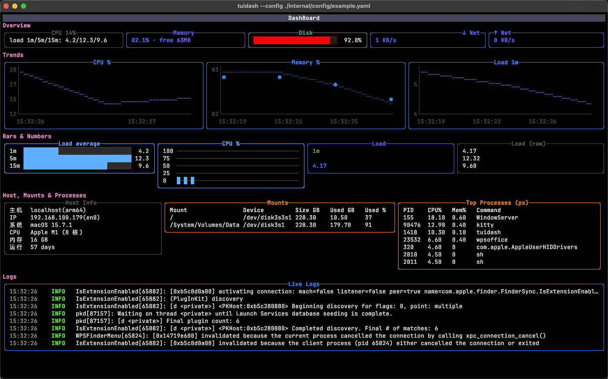

# tui-dashboard

[中文说明](README.zh-CN.md)

A config-driven terminal dashboard built on [Bubble Tea](https://github.com/charmbracelet/bubbletea).

A single YAML file defines the whole dashboard: **`sources`** (shell commands run on an
interval) and **`layout`** (rows of widgets that display their output).

Each source declares one of seven types — `text` `number` `array` `timeseries` `map` `table` `logs` —
which sets the output format the script produces and the widgets that accept it.

Widget titles, labels, formats and static text are Go templates; five color themes are included.

The repo ships an example config: [example.yaml](internal/config/example.yaml).



## Usage

Requires Go 1.25+.

```bash
chmod +x scripts/*.sh                  # once, in the repo

go run .                               # locate a config automatically (see below)
go run . --config path/to/config.yaml  # use this file
go run . --init                        # copy the bundled example and its scripts to the default config path
go run . -v                            # also print startup notes (config source, working directory, warnings)
```

Keys: `?` help · `q` / `Ctrl+C` quit · `↑`/`k` `↓`/`j` scroll · `PgUp`/`PgDn` page ·
`Ctrl+B`/`Ctrl+F` full page · `Ctrl+D`/`Ctrl+U` half page · `Home`/`End` · mouse wheel.

### Installing as a command

```bash
go build -o "$(go env GOPATH)/bin/tuidash" .
```

## Configuration file

Four top-level keys:

| Key | Meaning |
|-----|---------|
| `theme` | `default` \| `dracula` \| `gruvbox` \| `nord` \| `light`; empty = `default` |
| `poll_interval` | how often the UI re-renders (default `500ms`); unrelated to source intervals |
| `sources` | the data sources |
| `layout` | rows of widgets |

The config file is located in this order, first match wins:

1. `--config <path>` — that file, exactly.
2. `./config.yaml` in the current directory.
3. `$XDG_CONFIG_HOME/tui-dashboard/config.yaml` (usually `~/.config/tui-dashboard/config.yaml`).
4. None of the above — the bundled `internal/config/example.yaml`.

`go run . --init` copies the bundled example and `scripts/` to the default config path and
prints the paths. Existing files are not overwritten; missing scripts are added.

`--init` writes the Chinese-commented copy under a simplified Chinese locale and
`example.yaml` otherwise. Of `LC_ALL`, `LC_MESSAGES` and `LANG`, the first one set decides,
and only `zh_CN`, `zh_SG` and `zh-Hans*` count — `zh_TW` and `zh_HK` fall back to English.
Both files parse to the same config, so the choice changes only the comments a new user reads.

## Configuration options

Configuring the dashboard takes two steps:

1. **Declare the data** — `sources` lists the commands to run and the type of data each one
   produces.
2. **Arrange it** — `layout` places widgets in rows; each widget points at a source by name and
   picks out what it shows.

### `sources`

```yaml
sources:
  - name: cpu                  # referenced by widgets
    type: map                  # required: text|number|array|timeseries|map|table|logs
    cmd: ./scripts/sys_cpu.sh  # required: any shell command (run through sh -c)
    interval: 2s               # how often to run it
    timeout: 3s                # default: min(interval, 5s)
    history_cap: 80            # chart series length (default 60)
    log_cap: 200               # logs ring-buffer size (default 200)
    header: true               # type: table only — is the first line a header? (default true)
```

Each type has exactly one output format:

| `type` | the script prints | the parsed value | across frames |
|--------|-------------------|------------------|---------------|
| `text` | anything | a string | kept as-is, never parsed |
| `number` | a single number | a number | one sample per frame (the program timestamps it) |
| `array` | one number per line | a list of numbers, no timestamps | not accumulated — the x axis is the index |
| `timeseries` | `<timestamp> <value>` per line | a list of numbers | accumulated by timestamp (the script timestamps it) |
| `map` | `key: value` per line | an object of named fields | numeric fields accumulate; `value:` picks one |
| `table` | one record per line (header optional) | rows plus a column order | not accumulated |
| `logs` | one log line per line (time and level optional) | lines with a time and a level | appended to a ring buffer |

The parsed value is what templates see: a `map` source is an object, so `{{.mem.used_pct}}`
reads a field; a `number` source is the number itself, so `{{.load_num}}` is already a value; a
`text` or `logs` source is a single string. Timestamps stay inside the source — templates get
plain numbers, and the axis is handled by the renderer.

The raw output is kept as well, so a `text` widget shows exactly what a script printed whatever
type it declares. Any other shape must be converted **in the script**.

### `layout`

`layout` is a list of rows. A row with a `title` and no `widgets` is a standalone title band —
that is how the large header at the top of the example is built. The widgets of a row are laid
out side by side.

The lowest row that contains a `logs` panel absorbs the leftover height of the screen, showing
more of the log. Give that row a `height:` to fix it instead (the log row in the example is
pinned to 10 lines that way).

A widget's `width:` fixes the columns it takes, borders included; panels without one share
whatever is left. If a row's fixed widths add up to more than the terminal, all of them are
scaled down proportionally, so a narrow terminal truncates columns rather than breaking the
row.

```yaml
layout:
  - title: 'System Monitor {{now "01-02 15:04:05"}} {{.weekday}}'
    title_align: center
    color: '#f8f8f2'
    bg: '#44475a'            # paints the whole title row as a color band
  - title: Overview
    widgets:
      - type: stat
        source: cpu
        value: '{{.cpu}}'    # a template — omit it when the source type already says what to take
        format: "%.0f%%"     # Sprintf; can itself be a template
        title: CPU
        title_align: right   # left|center|right (default center)
```

Row fields: `title` `title_align` `color` `bg` `height` `widgets`.

Widget fields: `type` `source` `value` `title` `title_align` `color` `style` `format` `label`
`min` `max` `x_format` `y_format` `labels` `columns` `max_lines` `time_format` `text` `wrap`
`width` `height`.

### Widgets

| `type` | shows | source types it accepts |
|--------|-------|-------------------------|
| `stat` | one number, with an optional `label` above it | `number` `array` `timeseries` `map` |
| `gauge` | one number as a bar between `min` and `max` | `number` `array` `timeseries` `map` |
| `chart` | a series as a line (`style`: `braille` \| `dots` \| `line`) | `number` `array` `timeseries` `map` |
| `bar` | a series as bars (`style`: `hbar` \| `solid` \| `vbar`) | `number` `array` `timeseries` `map` |
| `table` | records as a table (`columns` sets the columns) | `table` |
| `logs` | a scrolling log buffer (`log_cap` lines deep) | `logs` |
| `text` | the raw output of the source, or a static `text:` string | all |

A widget renders the parsed value above, selected by `value:` — not the script output directly.
`stat` and `gauge` take the last value of what they are given, while `chart` and `bar` draw the
whole series; both read the same resolved value, so one source can serve several panels. `table`
and `logs` render one shape each and accept one source type; `text` accepts every type.

### `value:`

`value:` is a template that selects something out of the source (`'{{.used_pct}}'`). **When the
source's declared type already determines what to take, it can be omitted entirely** —
`number`, `array`, `timeseries`, `table` and `logs` all work that way. Only `map` cannot: an
object has several fields, and not naming one is ambiguous.

### Templates

Widget titles, bodies, `format`, `label`, static `text` and column titles are Go templates.
They can read the built-in `.date` / `.weekday` / `.time`, every source by name (shaped by its
declared type — `{{.mem.used_pct}}` for a `map`, `{{.load_num}}` for a `number`, a plain string
for `text` and `logs`), and the widget's own source fields flattened to the top level.

Row titles are the exception: they see only the three built-in fields, so `{{.host}}` in a row
title resolves to nothing. Live data belongs in a widget.

A source name doubles as a template field name, so avoid hyphens in it: `{{.disk_mounts}}`
resolves, while `{{.disk-mounts}}` is a template syntax error (Go template field names do not
accept `-`).
